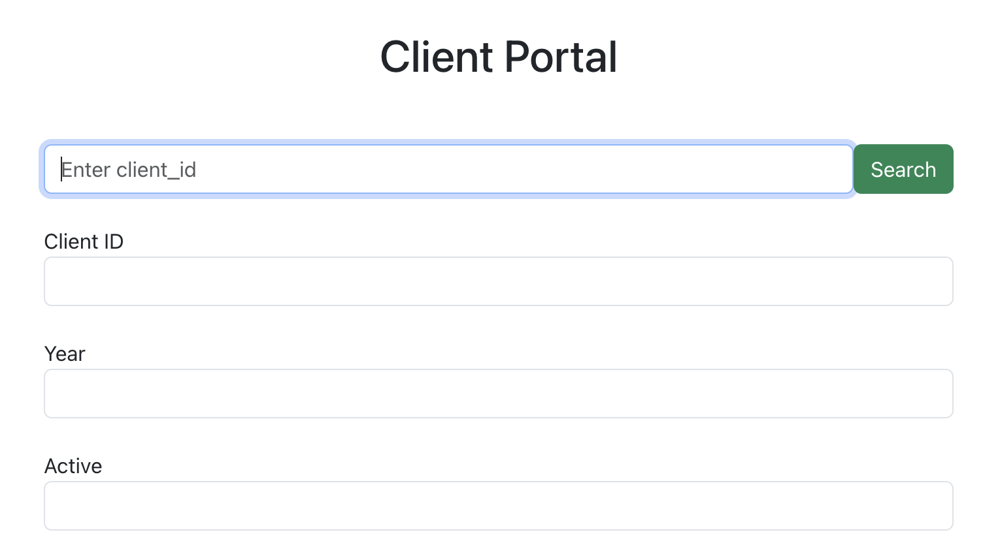
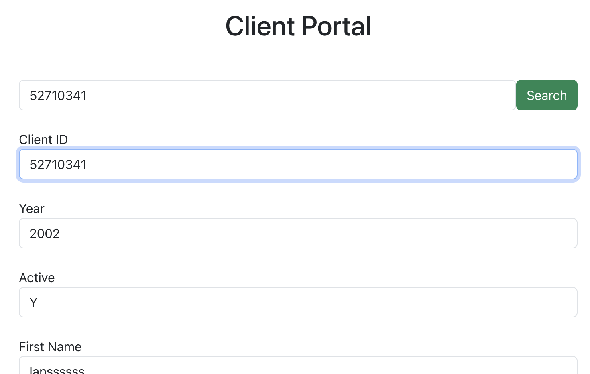
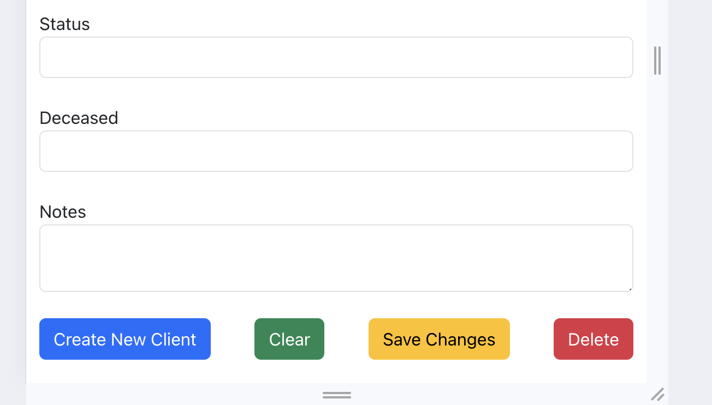

# Technologies Used

- React
- HTML
- CSS
- Bootstrap
- Node
- Express
- PostgreSQL
- Git

# Project / Repository Structure

- client (React)
- server (Node, Express)
- Data (inital data files + schema and seed files)

# Server

- Navigate into the server folder
- `npm install` to install required dependencies
- `nodemon index` to start the server on port 4000

# Web App

- Navigate into the server folder
- `npm install` to install required dependencies
- `npm start` to start the server on port 3000. It uses the pre-defined script in 'package.json' file.

The web-app will be hosted on port 3000.

# Database

Postgres will be hosted on port 5432.

## Web App Supports:

- Viewing existing clients and their associated data
- Creating a new Client
- Searching a client through `client_id`
- Modifying client data (except `client_id`)
- Deleting a client

Also, additional components and routes have been defined for future extension of this project. So, even though, the app in its current state does not need additional features right now due to limited scope, these files/code have been included in the repo.

## How to use the Web-App

### Initialization

- Setup Postgres

  - Create Tables using commands in 'Data/schema.sql'
  - Seed these tables with inital data using commands in 'Data/seed.sql'

- Start Server

- Launch Client (React) app

### Available Operations

**Search:**

- Enter the client-id of the client in the search bar and press search button
- This will populate all the fields below with the client data

**Edit:**

- Search for the client whose data you want to modify
- Edit any fields (except client_id).
- Once done, hit the save changes button to persist data in DB

**Create New Client:**

- Empty the form if it is currently filled by pressing the Clear button
- Enter data in all fields except the search bar and the Client ID field. Notes is optional
- Once done, hit the Create New Client button

**Delete Client:**

- Search for the client that you want to delete
- Once the data is populated, you can press delete to remove the client permanently

## Photos of web-app

---

# Thanks
